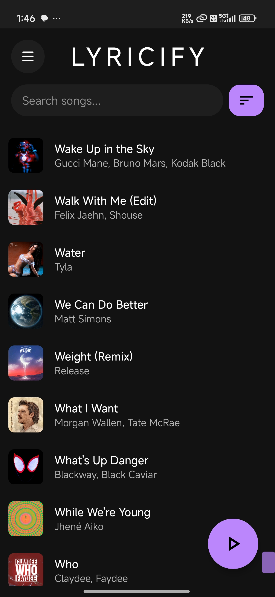
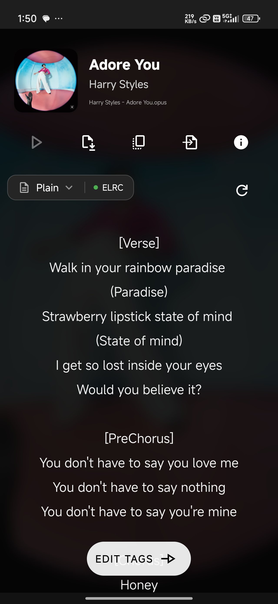
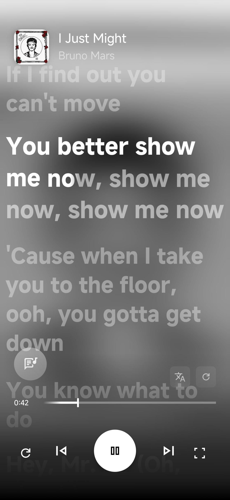
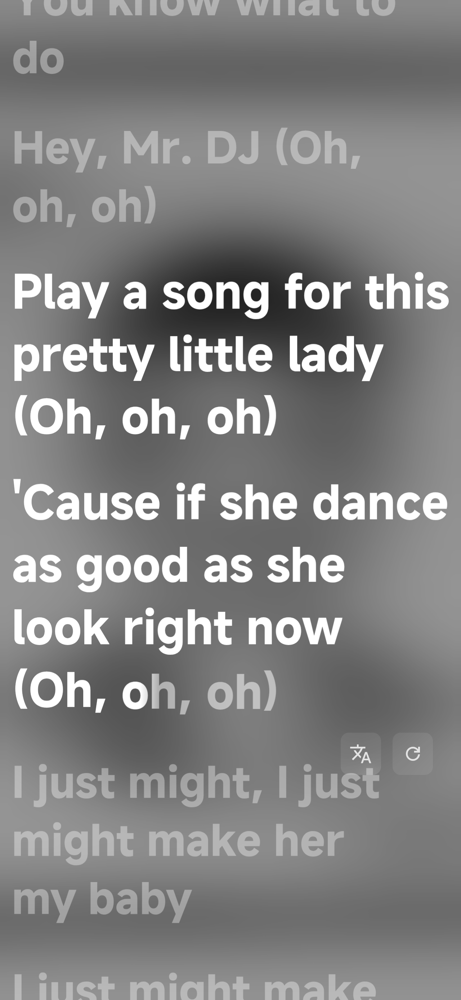
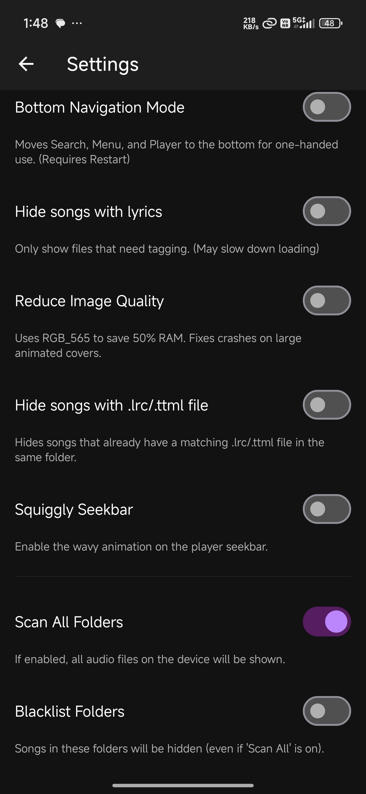
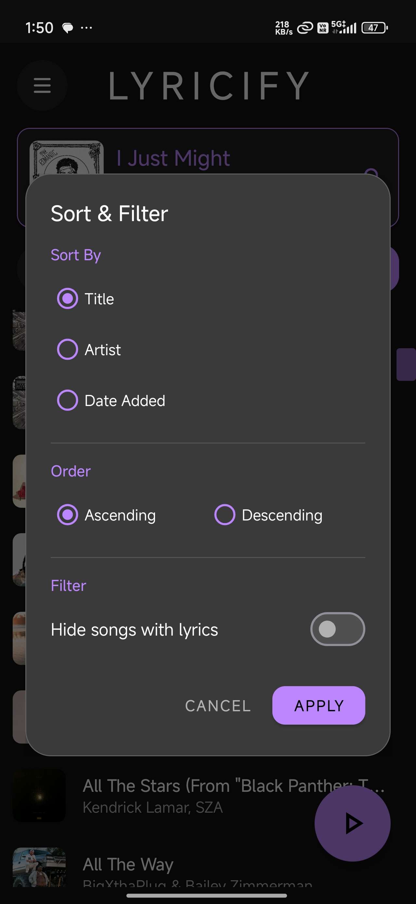
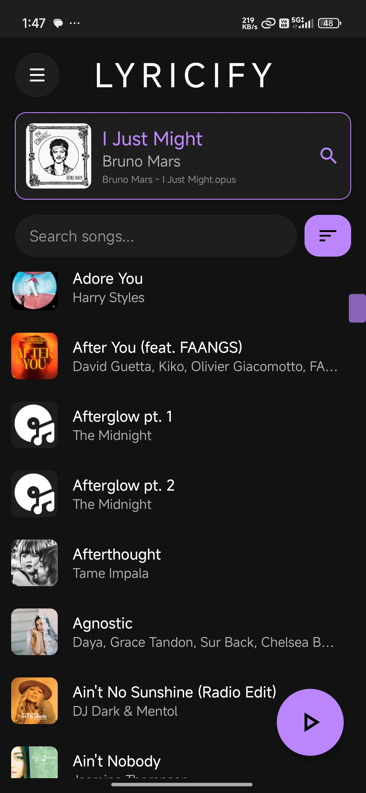

# 🎵 Lyricify

<div align="center">



**A powerful Android lyrics application with real-time synced lyrics, multiple rendering engines, and advanced tag editing**

[](https://www.android.com/)
[](https://android-arsenal.com/api?level=29)
[](LICENSE)

[Features](#features) • [Screenshots](#screenshots) • [Installation](#installation) • [Usage](#usage) • [Building](#building) • [Contributing](#contributing)

</div>

---

## ✨ Features

### 🎤 Advanced Lyrics Display
- **Multiple Format Support**: LRC, ELRC (Enhanced LRC), ELRC Multi-Person, LRC Multi-Person, TTML
- **Real-time Synchronization**: Word-by-word highlighting with dynamic glow effects
- **Three Rendering Engines**:
  - **Native Engine**: Custom Android view with optimized rendering
  - **YouLy+ Engine**: Web-based engine with advanced features
  - **Karaoke/Accompanist Engine**: Specialized karaoke-style display
- **Smart Animation**: Speed-adaptive glow effects that adjust based on lyric timing
- **Interactive Seeking**: Tap any line to jump to that timestamp

### 🎨 Customization
- **6 Font Styles**: Default, Serif, Sans Serif, Monospace, Cursive, Casual
- **Immersive Mode**: Full-screen lyrics experience with gesture controls
- **Squiggly Seekbar**: Animated, wave-based progress indicator with liquid effects
- **Layout Options**: Traditional top-based or modern bottom-based UI
- **Background Blur**: Native Android 12+ blur with fallback for older versions

### 🎵 Media Integration
- **Universal Player Support**: Works with any music player via Media Session API
- **Now Playing Detection**: Automatic artwork and metadata extraction
- **Playback Controls**: Play, pause, skip, and seek from within the app
- **Real-time Sync**: 60 FPS smooth scrolling and animation

### 🏷️ Tag Editor
- **Comprehensive Metadata Editing**: Title, Artist, Album, Genre, Year, Composer, and more
- **Artwork Management**:
  - Support for static images (JPEG, PNG)
  - **Animated artwork** support (GIF, WebP)
  - **Motion artwork** via Lyricify Companion app (video to image conversion)
  - Artwork resizing with quality presets
- **Lyrics Embedding**: Embed synced lyrics directly into audio files
- **Custom Fields**: Add any custom metadata tags
- **Batch Operations**: Save as .lrc/.ttml files alongside audio

### 📁 Library Management
- **Smart Filtering**:
  - Hide songs with embedded lyrics
  - Hide songs with external .lrc files
  - Folder whitelisting/blacklisting
- **Advanced Search**: Real-time search across title and artist
- **Multiple Sort Options**: By Title, Artist, or Date Added (ascending/descending)
- **Fast Scrolling**: Optimized RecyclerView with section headers

### 🚀 Performance Features
- **Background Caching**: Pre-loads lyrics for faster access
- **Low RAM Mode**: Optimized memory usage for older devices
- **Smart Image Loading**: Glide-based caching with animated artwork support
- **Scroll Optimization**: Flinging mode for smooth list performance

### 🔧 Advanced Features
- **Metadata API Integration**: Automatic song identification and metadata fetching
- **Offline Support**: Works with locally stored music files
- **Permission Management**: Smart storage permission handling for Android 11+
- **File Detection**: Automatic .lrc file detection for hiding feature
- **Update Checker**: Built-in update notification system

---

## 📸 Screenshots

<div align="center">

| Main Library | Lyrics View | Tag Editor |
|:---:|:---:|:---:|
|  |  |  |

| Lyrics Player | Immersive Mode | Settings |
|:---:|:---:|:---:|
|  |  |  |

| Sort Dialog | Now Playing |
|:---:|:---:|
|  |  |

</div>

---

## 📦 Installation

### Requirements
- Android 10 (API 29) or higher
- Storage permissions for accessing music files
- Notification access for media session integration
- (Optional) MANAGE_ALL_FILES permission for .lrc file detection

### Download
1. Download the latest APK from the [Releases](https://github.com/yourusername/lyricify/releases) page
2. Enable "Install from Unknown Sources" in your device settings
3. Install the APK
4. Grant required permissions when prompted

---

## 🎯 Usage

### First Launch
1. **Grant Storage Permission**: Allow access to your music library
2. **Grant Notification Access**: Enable media detection for Now Playing
3. **Library Scan**: The app will automatically scan your music files

### Getting Lyrics
1. **Tap a song** in your library
2. The app will attempt to identify the song and fetch lyrics
3. If identification fails, you can manually search
4. **Choose format**: Plain, LRC, ELRC, TTML, or Multi-Person variants

### Viewing Synced Lyrics
1. Open a song with synced lyrics
2. Tap the **"Synced Lyrics"** button
3. **Swipe or tap** to seek through the song
4. **Toggle player modes** with the layer icon
5. **Enter immersive mode** for distraction-free viewing

### Editing Tags
1. **Long-press** a song in the library
2. Select "Edit Tags"
3. Modify any metadata fields
4. **Change artwork**: 
   - Tap the artwork to select an image/video
   - For videos, Lyricify Companion app will convert to motion artwork
5. **Embed lyrics**: Use the embed button to save lyrics to the file
6. **Save changes** with the save button

### Settings & Customization
- **Folder Filtering**: Choose which folders to scan
- **Hide Options**: Hide songs with lyrics or .lrc files
- **UI Layout**: Switch between top and bottom navigation
- **Squiggly Seekbar**: Toggle animated seekbar
- **Low RAM Mode**: Enable for better performance on older devices

---

## 🛠️ Building from Source

### Prerequisites
```bash
- Android Studio Arctic Fox or later
- JDK 11 or later
- Android SDK 34
- Gradle 8.0+
```

### Dependencies
```gradle
// Core
implementation 'androidx.appcompat:appcompat:1.6.1'
implementation 'com.google.android.material:material:1.9.0'

// Image Loading
implementation 'com.github.bumptech.glide:glide:4.16.0'
implementation 'jp.wasabeef:glide-transformations:4.3.0'

// UI Components
implementation 'androidx.core:core-splashscreen:1.0.1'
implementation 'androidx.constraintlayout:constraintlayout:2.1.4'

// Native Libraries (TagLib for metadata)
```

### Build Steps
```bash
# Clone the repository
git clone https://github.com/amanrajaryan/lyricify.git
cd lyricify

# Open in Android Studio
# File > Open > Select the project directory

# Build the project
./gradlew assembleDebug

# Install on connected device
./gradlew installDebug
```

---

## 🏗️ Architecture

### Key Components

**MainActivity**
- Library management and song list
- Now Playing card integration
- Folder filtering and search

**LyricsActivity**
- Lyrics fetching and display
- Format selection (Plain, LRC, ELRC, TTML)
- Metadata caching
- Lyrics embedding and file saving

**SyncedLyricsActivity**
- Real-time synced lyrics rendering
- Three player modes (Native, YouLy+, Karaoke)
- Media session integration
- Immersive mode

**YoulyPlayerActivity**
- Dedicated player with YouLy+ engine
- Background lyrics search
- Animated artwork support

**TagEditorActivity**
- Comprehensive metadata editing
- Artwork management (static and animated)
- Lyrics embedding
- Custom field support

**SyncedLyricsView**
- Custom Android View for lyrics rendering
- 60 FPS smooth scrolling
- Dynamic glow effects based on animation speed
- Word-by-word synchronization

**SquigglySeekBar**
- Custom SeekBar with wave animation
- Harmonic wave combination for liquid effect
- Adaptive amplitude based on playback state

### Data Flow
```
MediaStore → LocalSong → API Identification → Lyrics Fetch → Cache → Display
                                                    ↓
                                            Tag Embedding ← Tag Editor
```

---


## 🧩 Companion App

**Lyricify Companion** is a separate app for advanced features:
- **Video to Motion Artwork**: Convert video files to optimized motion artwork
- **Frame Extraction**: High-quality frame extraction from videos
- Integration with main app via intent sharing

---

## 🐛 Known Issues

- **Android 11+ .lrc Detection**: Requires MANAGE_ALL_FILES permission
- **Some Players**: May not expose full Media Session metadata
- **Large Libraries**: Initial scan may take time on older devices

---


## 🤝 Contributing

Contributions are welcome! Please follow these guidelines:

1. Fork the repository
2. Create a feature branch (`git checkout -b feature/AmazingFeature`)
3. Commit your changes (`git commit -m 'Add some AmazingFeature'`)
4. Push to the branch (`git push origin feature/AmazingFeature`)
5. Open a Pull Request

### Code Style
- Follow Android Kotlin/Java style guide
- Use meaningful variable names
- Comment complex logic
- Test on multiple Android versions

---

## 📄 License

This project is licensed under the MIT License - see the [LICENSE](LICENSE) file for details.

---

## 🙏 Acknowledgments

- **TagLib** for audio metadata handling
- **Glide** for efficient image loading
- **Wasabeef** for Glide transformations
- **Material Design** components
- All contributors and testers

---

## 📧 Contact

For questions, suggestions, or bug reports:
- Open an [Issue](https://github.com/amanrajaryan/lyricify/issues)
- Email: amanrajaryan3@gmail.com
- Twitter: [@yourhandle](https://twitter.com/idk)

---

<div align="center">

**Made with ❤️ for music lovers**

⭐ Star this repo if you find it useful!

</div>
